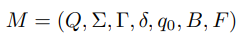

# FLA (Fall 2022) — Project

Designed for course: [Formal Languages and Automata (Fall 2022)](https://cs.nju.edu.cn/bulei/FLA22.html), Nanjing University

**May The Force Be With You!**

<hr>


- [FLA (Fall 2022) — Project](#fla-fall-2022--project)

  - [1. 背景](#1-背景)

  - [2. 实验描述](#2-实验描述)

  - [3. 任务介绍](#3-任务介绍)

    - [一：解析器](#一解析器)
    - [二：模拟器](#二模拟器)
      - [普通模式](#普通模式)
      - [`verbose` 模式](#verbose-模式)
    - [三：多带图灵机程序](#三多带图灵机程序)

  - [4. 验收测试](#4-验收测试)

  - [5. 实验提交](#5-实验提交)

    - [提交格式](#提交格式)
    - [提交方法](#提交方法)
    - [截止日期](#截止日期)

  - [附录 图灵机程序语法](#附录-图灵机程序语法)

    - [示例](#示例)

      

## 1. 背景

在 [FLA](https://cs.nju.edu.cn/bulei/FLA22.html) 课程中，我们已经学习了图灵机以及它的各种变体。你想(da)必(gai)已经了解了图灵机的形式化定义，甚至也能自己设计一些小图灵机了。但给定一个图灵机和一个输入串，当我们把这个串丢给图灵机之后，图灵机到底都捣腾了啥？它是怎么一步步迈向停机的？

那我们在纸上画个状态机呗，看它是怎么在状态之间跳转的不就行了？

不！这太不优雅了！作为程序猿，我们当然要用 coding 的方式来展现自己的实力啦！那么在接下来的这个实验里，就让我们带着你的 code，一起来愉快地探索图灵机内部的运行机制吧！

## 2. 实验描述

在本次实验中，我们 (你) 的目标是要实现一个**多带 (确定性、多条无限纸带) 图灵机**的模拟器，并且能够在上面正确模拟运行符合[特定语法](#附录-图灵机程序语法)的图灵机程序。

你需要用 **C++** 实现一个 Linux 下运行的命令行工具 `turing`，用于模拟运行图灵机程序。在命令行中运行 `turing`，传入图灵机程序的文件名和输入字符串作为参数，并输出一行运行结果。

```shell
$ turing --help
usage: turing [-v|--verbose] [-h|--help] <tm> <input>
$ turing palindrome_detector.tm 100010001
true
$ turing palindrome_detector.tm 10001000
false
$ turing palindrome_detector.tm 100A1A001
illegal input
```

我们希望你编写一个**用户友好的命令行工具**：

1. **遵循命令行工具的基本规范**。例如，你的命令行工具可能被其他脚本调用，因此请不要在标准输出中打印额外的信息 (如日志)，确保 stdout 仅输出一行运行结果。出错时，请将错误信息输出到标准错误输出 (stderr) 并返回错误 exit code。一个更好的 practice 是提供 -v 或 --verbose 选项，在 verbose 模式下打印更多的信息，这也可以帮助你调试。

2. **不要在当前目录产生多余的临时文件**。Linux 系统提供了 mktemp 系列函数，每个主流编程语言都有相应的 API。

3. **做好错误处理**。确保你程序的鲁棒性，出现异常时最好别玩崩溃。

## 3. 任务介绍

为了达到我们的目标，具体来说，你需要完成以下三个任务。

### 一：解析器

参考附录中给出的[图灵机程序语法](#附录-图灵机程序语法)，实现一个**多带图灵机程序解析器**。

要求：

1. 该解析器能够正确解析读入的图灵机程序 (即命令行参数中的 `<tm>`)。

   **错误处理**：若输入的图灵机程序不符合语法，在 stderr 中输出一行 `syntax error`，并返回错误 exit code。

   **选做部分**：在指定了 `-v|--verbose` 参数时, 给出不符合语法的图灵机程序片段及相关提示，这也可以帮助你调试图灵机程序。

2. 图灵机程序解析完成后，得到与之对应的一个**多带图灵机模拟器** (见**任务二**)。

> 当参数个数或者格式不太对劲的时候，咱们该做点啥？(提示：再看看实验描述)

### 二：模拟器

图灵机程序经过你的解析器解析后，我们将得到一个对应的**多带图灵机模拟器**。模拟器读入一个字符串 (即命令行参数中的 `<input>`) 作为图灵机的输入。

为了帮助你实现一个用户友好的命令行工具，我们为模拟器设计了两种运行模式：普通模式和 `verbose` 模式。在普通模式下，你只要简单地单行输出运行结果即可；而在 `verbose` 模式下，你需要展示模拟器中图灵机的具体行为。

要求：

#### 普通模式

1. 判断输入串的合法性 (也即判断所有字符是否均属于**输入符号集**，输入符号集的定义参见 **[语法描述](#附录-图灵机程序语法)**)。
   **错误处理**：若输入串不合法，在 stderr 中输出一行 `illegal input`，并返回错误 exit code。
2. 模拟运行合法输入串。运行结束后，将第一条纸带上的内容 (首尾分别为纸带上最左和最右非空格符号) 输出到 stdout。

#### `verbose` 模式

1. 判断输入串的合法性 (也即判断所有字符是否均属于**输入符号集**，输入符号集的定义参见 **[语法描述](#附录-图灵机程序语法)**)。

   **错误处理**：若输入串不合法，在 stderr 中按以下格式报告输入错误 (只需要报告第一个非法字符即可)，并返回错误 exit code。

   ```plain
   Input: 100A1A001
   ==================== ERR ====================
   error: 'A' was not declared in the set of input symbols
   Input: 100A1A001
             ^
   ==================== END ====================
   ```

   若输入串合法，按以下格式输出提示信息，并转 2：

   ```plain
   Input: 1001001
   ==================== RUN ====================
   ```

2. 模拟运行合法输入串。对于图灵机上的每一次转移，在 stdout 中按以下格式给出图灵机的一个瞬时描述：

   ```plain
   Step   : 0
   State  : 0
   Index0 : 0 1 2 3 4 5 6
   Tape0  : 1 0 0 1 0 0 1
   Head0  : ^
   Index1 : 0
   Tape1  : _
   Head1  : ^
   ---------------------------------------------
   Step   : 1
   State  : cp
   Index0 : 0 1 2 3 4 5 6
   Tape0  : 1 0 0 1 0 0 1
   Head0  : ^
   Index1 : 0
   Tape1  : _
   Head1  : ^
   ---------------------------------------------
   ......
   ......
   ......
   ---------------------------------------------
   Step   : 29
   State  : halt_accept
   Index0 : 7 8 9 10
   Tape0  : t r u e
   Head0  :       ^
   Index1 : 1
   Tape1  : _
   Head1  : ^
   ---------------------------------------------
   ```

   > *注 1*：`Index0`, `Tape0`, `Head0` 中的 `0` 表示纸带的编号；
   >
   > *注 2*：`Step 0` 中 `Index0` 后的第一个索引 (如上述示例中的 `0`) 表示初始时纸带上包含输入的最左单元位置的索引；
   >
   > *注 3*：初始只有第一条纸带有输入，其他纸带均为空；第一条纸带读写头初始位置为包含输入的最左单元位置，其他纸带的初始位置均为索引 `0`；
   >
   > *注 4*：一般情况下，两端非空格符号外侧的空格符号和对应索引都不需要打印，只需打印纸带上最左非空格符号到最右非空格符号之间的符号及对应索引；
   >
   > *注 5*：**当读写头指向的位置为非空格符号外侧的空格符号时，需要打印必要的空格符号及对应索引，空格符号以 `'_'` 表示**。
   >
   > 示例：
   >
   > ```plain
   > Step   : 8
   > State  : cp
   > Index0 : 0 1 2 3 4 5 6 7
   > Tape0  : 1 0 0 1 0 0 1 _
   > Head0  :               ^
   > Index1 : 0 1 2 3 4 5 6 7
   > Tape1  : 1 0 0 1 0 0 1 _
   > Head1  :               ^
   > ---------------------------------------------
   > Step   : 24
   > State  : cmp
   > Index0 : 7
   > Tape0  : _
   > Head0  : ^
   > Index1 : 1
   > Tape1  : _
   > Head1  : ^
   > ---------------------------------------------
   > ```
   >
   > *注 6*：`Index` 中相邻两项之间以一个空格为间隔，`Tape` 上的符号与 `Index` 中对应的索引靠左对齐。
   >
   > 示例：
   >
   > ```plain
   > Step   : 19
   > State  : s3
   > Index0 : 0 1 2 3 4 5 6 7 8 9 10 11 12
   > Tape0  : 1 1 1 0 0 0 0 0 1 1 1  0  0
   > Head0  :             ^
   > Index1 : 6 7 8 9 10 11 12 13
   > Tape1  : 1 1 1 1 0  0  0  1
   > Head1  :               ^
   > ---------------------------------------------
   > ```
   >
   > *注 7*：若需要向 `0` 索引左边的纸带单元中读写字符，请在 `Index` 中按照 `"... 3 2 1 0 1 2 3 ..."` 的格式 (即省略 `-3 -2 -1` 等负索引的负号) 对索引进行描述。

3. 模拟运行结束后，将第一条纸带上的内容 (首尾分别为纸带上最左和最右非空格符号) 作为最后的输出，对于上述格式描述中的示例，最后纸带上的内容为 `true`。并按以下格式输出信息：

   ```plain
   Result: true
   ==================== END ====================
   ```

### 三：多带图灵机程序

使用附录中描述的[图灵机程序语法](#附录-图灵机程序语法)，实现以下两个图灵机程序。

1. 实现二进制数的循环右移操作。该图灵机的输入为一个二进制数，以$\{0,1\}^*$中的字符串表示；输出将该二进制数循环右移一位的结果。例如对于输入`11101001`而言，输出应当为`11110100`。

   **特别要求：输出串需要与输入串占据相同的纸带位置。**即在verbose模式下运行时，应当能看出输出结果是从纸带下标为0的位置开始的。下图所示的结果是符合要求的：

   ```shell
   Step   : 19
   State  : halt
   Index0 : 0 1 2 3 4 5 6 7
   Tape0  : 1 1 1 1 0 1 0 0
   Head0  :               ^
   Index1 : 0
   Tape1  : _
   Head1  : ^
   ```

   下图所示的结果是不符合要求的：

   ```shell
   Step   : 19
   State  : halt
   Index0 : 1 2 3 4 5 6 7 8
   Tape0  : 1 1 1 1 0 1 0 0
   Head0  :               ^
   Index1 : 0
   Tape1  : _
   Head1  : ^
   ```

   请将该图灵机的编码文件命名为`case1.tm`，文件位置见[**实验提交**](#5-实验提交)部分。

2. 实现一个图灵机，判定如下语言：
   $$
   L = \{w \in \{1\}^*\ |\ \exist n \in N, |w| = n^2\}
   $$
   若输入字符串在该语言中，则在第一条纸带上打印`true`后停机，否则打印`false`后停机。**请确保停机时第一条纸带上除了判定结果外没有其他内容**。示例输入输出如下：

   ```shell
   $ ./turing case2.tm 1
   true
   $ ./turing case2.tm 11
   false
   $ ./turing case2.tm 1111
   true
   $ ./turing case2.tm 111111
   false
   $ ./turing case2.tm 111111111
   true
   ```

   请将该图灵机的编码文件命名为`case2.tm`，文件位置见[**实验提交**](#5-实验提交)部分。


## 4. 验收测试

1. **任务一** & **任务二**。我们会使用另外准备的图灵机程序以及对应的一组输入来对你实现的图灵机解析器和模拟器的正确性进行测试。

2. **任务三** 测试方案：
   - 测试使用的命令格式见 [**实验描述**](#2-实验描述)。
   - 我们会使用各种规模的输入对你的图灵机程序的运行结果正确性进行测试。
   - 我们也会在小规模的输入上对你的图灵机程序的运行行为正确性进行验证 (`verbose` 模式)。

3. 为方便我们进行测试，请确认以下事项：
   - 你的项目能够在 ubuntu-20.04 x64 上使用 g++ 9.3.0 编译。
   - 你的项目编译生成的可执行文件命名为 `turing`。

## 5. 实验提交

**重要声明：为维护学术诚信，我们将对所有提交代码进行查重！请各位同学务必独立完成本项目！**

### 提交格式

将以下内容打成压缩包 (`学号-姓名.tar.gz`) 上传：

1. 源代码目录 `turing-project/`。仅包含源代码。请确保你源代码只依赖于 C++ 标准库；请不要将二进制文件等能够被源码生成的文件打在压缩包中。

2. 简短的编译说明 `README.md`。

3. 图灵机程序目录 `programs/`。目录内包含两个图灵机编码文件，分别为 `case1.tm`及 `case2.tm`。

4. 实验报告 `学号-姓名.pdf`。报告内容包括：分析与设计思路、实验完成度、实验中遇到的问题及解决方案、总结感想，对课程和实验的意见与建议，以及其他任何想写的内容。

文档结构示例如下：

```plain
|— 201220XXX-张三.tar.gz (502022XXXX-李四.tar.gz)
   |— 201220XXX-张三.pdf (502022XXXX-李四.pdf)
   |— programs
      |— case1.tm
      |— case2.tm
   |— README.md
   |— turing-project
      |— XX.cpp
      |— ......
```

### 提交方法

本次实验使用box.nju.edu.cn进行提交，提交链接为https://box.nju.edu.cn/u/d/f7fb483ce7be4c109706/

### 截止日期

2023-1-3 23:59:59

<hr>


## 附录 图灵机程序语法

图灵机的形式化描述如下：

<p align="center"></p>

下面定义的图灵机程序语法完整地刻画了上述七部分内容。

1. **状态集 Q**：以 `#Q` 开头。**占据 (且仅占据) 图灵机程序的一行** (即不包括回车换行)；`'#'` 为该行的第一个字符 (以下2-7同)；各状态之间以英文逗号 `','` 分隔。状态用一个或多个**非空白字符** (字母`a-z,A-Z`、数字`0-9`和下划线`_`) 表示，称为该状态的**标签**，如 `"10"`、`"a"`、`"state1"` 等。语法格式为 `#Q = {q1,q2,...,qi}`。**`'='` 两边各有一个空格`' '`** (以下2-7同)。

   示例：

   ```plain
   #Q = {0,cp,cmp,mh,accept,accept2,accept3,accept4,halt_accept,reject,reject2,reject3,reject4,reject5,halt_reject}
   ```

2. **输入符号集 S**：以 `#S` 开头。各符号之间以英文逗号 `','` 分隔。输入符号的可取值范围为除 `' ' (space)`、`','`、`';'`、`'{'`、`'}'`、`'*'`、`'_'` 外的所有 **ASCII 可显示字符** (定义参见 ***[维基百科](https://zh.wikipedia.org/wiki/ASCII )*** )。语法格式为 `#S = {s1,s2,...,sj}`。

   示例：

   ```plain
   #S = {0,1}
   ```

3. **纸带符号集 G**：以 `#G` 开头。各符号之间以英文逗号 `','` 分隔。纸带符号的可取值范围为除 `' ' (space)`、`','`、`';'`、`'{'`、`'}'`、`'*'` 外的所有 **ASCII 可显示字符**，规定用 `'_'` 表示空格符号。语法格式为 `#G = {s1,s2,...,sk}`。

   示例：

   ```plain
   #G = {0,1,_,t,r,u,e,f,a,l,s}
   ```

4. **初始状态 q0**：以 `#q0` 开头。语法格式为 `#q0 = q`。

   示例：

   ```plain
   #q0 = 0
   ```

5. **空格符号 B**：以 `#B` 开头。语法格式为 `#B = b`。在本实验中，**空格符号规定为 `'_'`**。

   示例：

   ```plain
   #B = _
   ```

6. **终结状态集 F**：以 `#F` 开头。各状态之间以英文逗号 `','` 分隔。语法格式为 `#F = {f1,f2,...,fn}`。

   示例：

   ```plain
   #F = {halt_accept}
   ```

7. **纸带数 N**：以 `#N` 开头。语法格式为 `#N = n`。

   示例：

   ```plain
   #N = 2
   ```

8. **转移函数 delta**：每个转移函数占用 (且仅占用) 图灵机程序的一行，行内容为一个五元组。五元组格式为："<旧状态> <旧符号组> <新符号组> <方向组> <新状态>"，元组各部分之间以一个空格分隔。

   - **(新、旧) 状态** 定义见 **状态集**。

   - **(新、旧) 符号组** 均由 `n` 个**纸带符号**组成的字符串表示。**需要注意的是**，除纸带符号集中的符号外，**新、旧符号组中均可能出现` '*'`**，该符号用于匹配**除空格符号`'_'`外的**任意符号。相应的，纸带符号集（和输入符号集）中都不应出现` '*'`。（新、旧）符号组中可以出现多于一个的` '*'`，但使用时有一定限制。本次实验中，` '*'`的使用包含以下两种情况：

     - 旧符号组中某个符号为`'*'`，新符号组中对应位置上的符号不为` '*'`：无论对应纸带读写头下的符号是什么，都按照新符号组的要求将其改写；
     - 旧符号组中某个符号为`'*'`，新符号组中对应位置上的符号也为`'*'`：无论对应纸带读写头下的符号是什么，都保留这个字符不变

     两种情况的具体使用示例请看下文。

   - **方向组** 由 `n` 个以下三个符号之一组成的字符串表示：`'l'`、`'r'` 或者 `'*'`，分别表示向左移动、向右移动和不移动。

   示例：

   ```plain
   #G = {_, 0, 1}		; 纸带符号集
   ; ......
   cmp 01 __ rl reject ; 当前处于状态 cmp
                       ; 两个带头下符号分别为 '0' 和 '1'
                       ; 
                       ; 下一步第一个带头向右移动，第二个带头向左移动
                       ; 下一个状态为 reject
                       
   idle ** ** ** idle	; 当前处于状态idle
   					; 两个带头下符号可以是 '0' 或 '1' 中的任意一个
   					; 将要写入的新符号和原符号保持一致
   					; 下一步两个带头均不移动
   					; 下一个状态为idle
   					
   copy 0* 00 ll copy	; 当前处于状态copy
   					; 第一条纸带的带头下符号为 '0' ，第二条纸带的带头下符号为'0' 或 '1' 中的任意一个
   					; 将要写入的新符号为 '0' 和 '0'
   					; 下一步两个带头均向左移动
   					; 下一个状态为copy					
   ```

9. **注释和空行**：你只需要处理行注释，行注释以英文分号 `';'` 开头。在解析程序时应当忽略注释和空行。

   示例：

   ```plain
   ; State cmp: compare two strings
   
   0 __ __ ** accept ; empty input
   ```

### 示例

完整的图灵机程序示例参见 *[palindrome_detector_2tapes.tm](examples/palindrome_detector_2tapes.tm)*。
